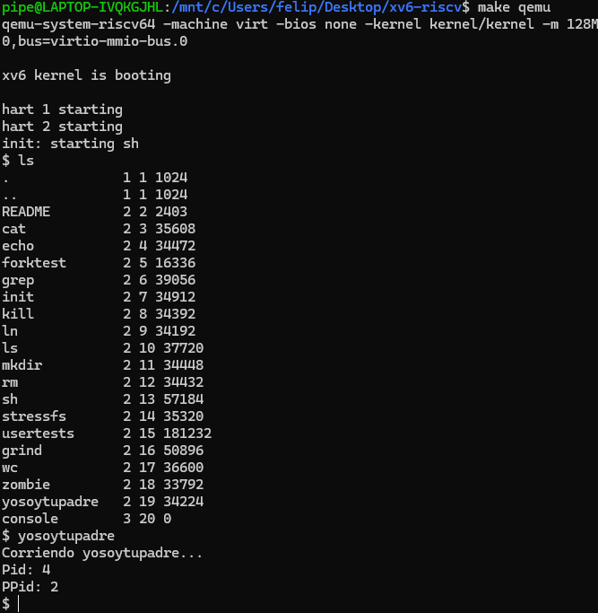

# Tarea 1

## Funcionamiento de las llamadas al sistema

A Continuación se mostrará imagenes sobre el funcionamiento de las llamadas al sistema, donde se puede notar el llamado a la función `yosoytupadre` que entregará el Id del padre y del hijo.

 


## Expliación de las modificaciones realizadas

Ahora bien, para la realización de esta función se tuvieron que modificar archivos por el lado del kernel y por el lado del usuario.

- Kernel:
	* syscall.h: Se le añade la linea de codigo `#define SYS_getppid 22` alfinal, usando la misma sintaxis que el codigo del resto.
	* syscall.c: Por un lado, al igual que el resto, debemos ingresar `extern uint64 sys_getppid(void);`. Luego debemos ingresar dentro de `static uint64 (*syscalls[])(void) = {...}` debemos ingresar `[SYS_getppid] sys_getppid(void);`
	* sysproc.c: En este caso, debemos agregar la siguiente linea de codigo `uint64 sys_getppid(void){ return myproc()->parent->pid; }`
- User:
	* user.h: Ingresamos el siguiente codigo: `int getppid(void);`
	* usys.s: En este caso se ingresa el siguiente codigo `entry("getppid");`
- Makefile
	* En este caso debemos ingresar el siguiente codigo en la sección de UPROGS añadimos el siguiente codigo: `$U/_yosoytupadre\` alfinal.


Además de la creacion de un archivo para la funcion el cual sería `yosoytupadre.c`, donde se implementará el codigo que devuelve el id del padre y del hijo, el cual es el siguiente:


```
#include "kernel/types.h"
#include "kernel/stat.h"
#include "user/user.h"


int
main(int argc, char *argv[])
{
    int pid = getpid();
    int ppid = getppid();
    printf("Corriendo yosoytupadre... \n");
    printf("Pid: %d\n", pid);
    printf("PPid: %d\n", ppid);
    exit(1);
}

```

Y, así es posible correr la funcion yosoytupadre luego de correr `make qemu`.


## Dificultades encontradas y cómo se resolvieron

Algunos de los problemas que tuve fue más por el area de la investigación, en si en la prueba si logre realizar bien (con unas breves equivocaciones en la redacción del codigo), pero basicamente en entender que es lo que tenía que ir en cada archivo y entender que pasaba en cada archivo, por lo cual eso fue mi parte más lenta. Realice busquedas por varias paginas que fueron indicando lo mismo, luego se volvio muy intuitivo porque también se notaba que el codigo nuevo por ingresar debía tener similitud con el codigo que ya estaba en el archivo, lo que hizo más logico los cambios por hacer.

