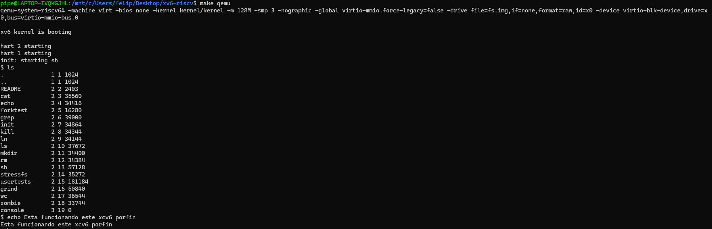
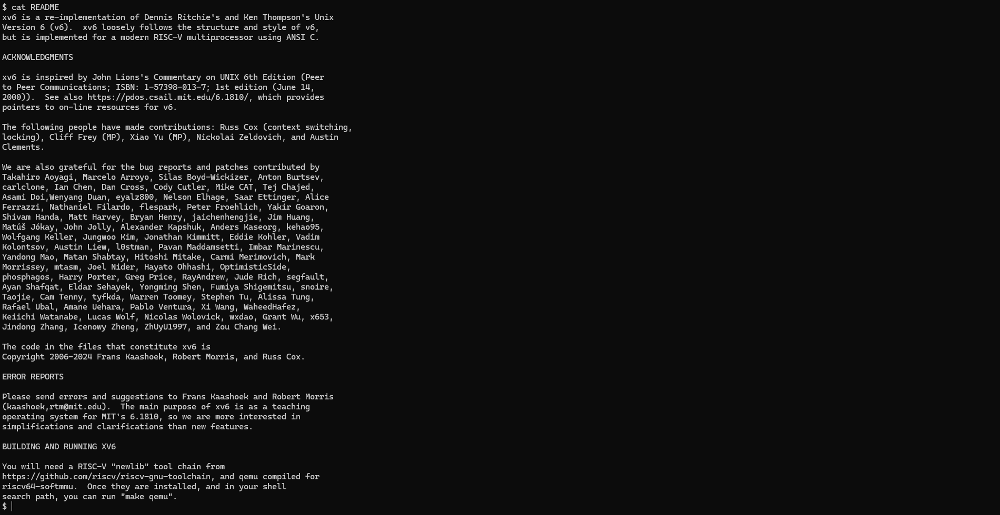

# Tarea 0

## Pasos seguidos para instalar xv6

El orden de los pasos fue el siguiente:

1. Instalar la Toolchain de riscv: Comence con este paso ya que es crucial para el funcionamiento de xv6-riscv. De manera que, se comnezo con clonar el repositorio de la toolchain con `git clone https://github.com/riscv/riscv-gnu-toolchain` donde luego ingresamos a la carpeta. Así, hay que seguir los pasos de instalacion que indica este repositorio en sus prerequisitos, lo cual uno es instalar `$ sudo apt-get install autoconf automake autotools-dev curl python3 python3-pip libmpc-dev libmpfr-dev libgmp-dev gawk build-essential bison flex texinfo gperf libtool patchutils bc zlib1g-dev libexpat-dev ninja-build git cmake libglib2.0-dev libslirp-dev`. Luego, como indican los pasos `./configure --prefix=/usr/local`, para finalmente realizar un `sudo make`

2. Instalar qemu: Se procederá a la instalación de qemu con e siguiente codigo `wget https://download.qemu.org/qemu-7.2.0.tar.xz` donde luego para extraerlo debemos usar el comando `tar xf qemu-7.2.0.tar.xz`. Luego, entramos en la carpeta e ingresamos el siguiente codigo `./configure --disable-kvm --disable-werror --prefix=/usr/local --target-list="riscv64-softmmu"` luego realizamos un `sudo make`, despues `sudo make install` y asi se tiene instalado qemu.

3. Creación repositorio: Para este paso, se realizo una clonación del repositorio que fue resultado de un fork del repositorio del profesor, lo que resulta en el siguiente comando `git clone https://github.com/Felipe700/xv6-riscv.git` donde luego creo una nueva rama con el comando `git branch FelipeM_T0` (Anteriormente este era el nombre de la branch, luego por temas de instrucciones realice un cambio del nombre de la branch con el comando `git branch -m felipe_meneses_t0`). Luego ingresamos a la rama con `git checkout FelipeM_t0` (recordar que realice un cambio de nombre de la branch)

4. Correr xv6: Ingresamos a la carpeta `cd xv6-riscv` donde luego realziamos `make qemu`, donde ya es funciona xv6.

## Problemas encontrados y soluciones

En un comienzo tuve bastantes problemas con la toolchain, esta no la tenia instalada, y como no sabia del tema, se volvio un tema de harta busqueda en internet de soluciones, pero nada fue claro, asi mismo como la incompatibilidad entre versiones provocaba muchas veces error. Es así como, hablando con compañeros pude darme cuenta de la version en especifica de qemu que funcionaba con Ubuntu 22.04. De manera que, pude lograr la instalación correcta de xv6 y su funcionamiento.

## Confirmación de que xv6 está funcionando correctamente

A continuación se mostrará imagenes mostrando el funcionamiento de xv6:

