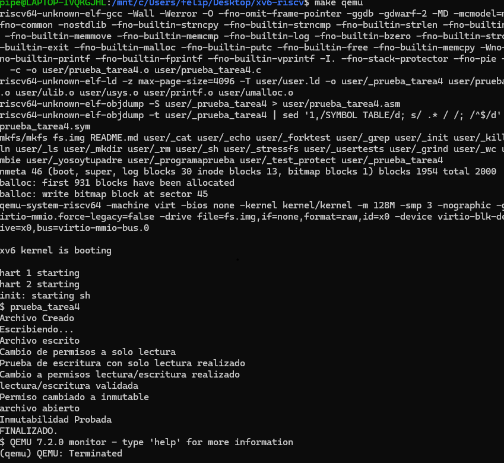

# Tarea 2

## Funcionamiento y lógica del sistema de prioridades

A continuación se motrarán imagenes sobre el funcionamiento de la llamada al sistema, donde se podrá notar el llamado a la función `programaprueba` que se encargará de mostrar los procesos con su respectivo id.

 


## Expliación de las modificaciones realizadas

Ahora bien, para la realización de esta función se tuvieron que modificar archivos por el lado del kernel y por el lado del usuario.

- Kernel:
	* proc.c: Se le añade la linea de codigo `p->prioridad = 0;` y  `p->boost = 1;`, que se será donde se definen las variables para la prioridad de los procesos. Luego se añade `p->prioridad += p->boost;`, `if(p->prioridad >= 9){ p->boost = -1;}` y `if(p->prioridad <= 0){p->boost = 1;}` en el mismo archivo, pero en la parte de schedule(void). 
	* proc.h: En este archivo añadiremos las variables anteriores pero para definirlas, la cual es `int prioridad` y `int boost` 

- Makefile
	* En este caso debemos ingresar el siguiente codigo en la sección de UPROGS añadimos el siguiente codigo: `$U/_programaprueba\` alfinal.

Además de la creacion de un archivo para la funcion el cual sería `programaprueba.c`, donde se implementará el codigo para la creación de los 20 procesos.

```
#include "kernel/types.h"
#include "user/user.h"
int
main()
{
  int n = 20;
  printf("Comenzando la creación de %d procesos nuevos\n", n);
  for(int i = 0; i < n; i++) {
    int nuevo_proceso = fork();
    if(nuevo_proceso == 0) {
      sleep(i);
      printf("Ejecutando proceso felipe pid: %d\n", getpid());

      exit(0);
    }
  }
  for(int i = 0; i < n; i++) {
    wait(0);
  }
  exit(0);
}
```

Y, así es posible correr la funcion programaprueba luego de correr `make qemu`.


## Dificultades encontradas y soluciones implementadas

Algunos de los problemas que tuve fue más por el area de la investigación, en si en la prueba si logre realizar bien (con unas breves equivocaciones en la redacción del codigo), pero basicamente en entender que es lo que tenía que ir en cada archivo y entender que pasaba en cada archivo, por lo cual eso fue mi parte más lenta. Realice busquedas por varias paginas que fueron indicando lo mismo, luego se volvio muy intuitivo porque también se notaba que el codigo nuevo por ingresar debía tener similitud con el codigo que ya estaba en el archivo, lo que hizo más logico los cambios por hacer.

Otra de las dificultades que tuvo fue un problema que no entendia su origen y se puede ver en la siguiente imagen:
 

Me di cuenta, tras prueba y error, que alfinal esto se debía a que los procesos no terminaban de correr completamente cada uno y esto originaba una combinacion con el siguiente proceso, lo que provocaba en un error visual, esto se soluciono de dos manera, con la utilización de sleep() y con la utilización de wait() que ambos ayudaban a mantener el proceso ordenando en su carga.
